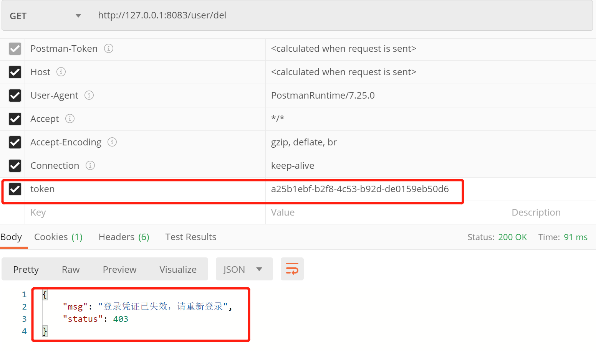

# 一、Spring Boot整合Shiro介绍

&emsp;&emsp;Spring Boot整合Shiro，前后端分离，多Realm管理，具体实现思路和细节请参考:

> [Spring Boot整合Shiro实现前后端分离](https://www.jianshu.com/p/d39d6f737449)

- 前后端分离，使用token进行认证
- 多Realm管理，增加系统灵活性
- 使用Redis存储token信息，加强数据安全性

# 二、前期准备

## 2.1 MySQL数据库准备:

- 对应的SQL见 /src/main/resources/database/createTable.sql
- 创建数据库mybatis
- 建表 - 用户/角色/权限/用户-角色/角色-权限共5个表，导入预置数据
- MySQL配置信息见 /src/main/resources/application.properties

## 2.2 Redis数据库准备:

- Redis配置信息见 /src/main/resources/application.properties

## 2.3 PostMan测试工具准备:

- [下载地址](https://www.postman.com/)

# 三、测试信息

&emsp;&emsp;用户登录，返回生成的token信息：

&emsp;&emsp;用户携带token信息查询文章（**有对应权限**）：

&emsp;&emsp;用户携带token信息删除用户（**无权限**）：

&emsp;&emsp;用户携带token信息退出登录：

&emsp;&emsp;用户退出登录后携带原token信息删除用户：

